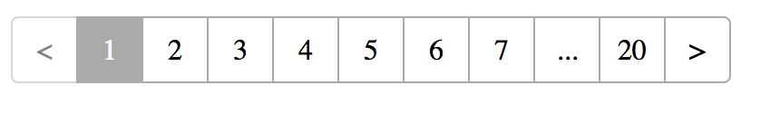

# React Pagination Component

# Install
- npm install mahesh-react-pagination

# The Component supports two kinds of pagination : Static and Remote Pagination.
- For Static pagination, api call makes once. Correnpsonding data for page will be provided to consumer.
- For remote pagination, for each page api call is being made and data will be provided to consumer.

# Component props
- General
	- source -> source api url
	- pageSize -> no. of elements in page
	- beforeLoad -> function that calls before paginating
	- afterLoad -> function that calls after pagination with passes data to consumer
	- remote -> boolean flag which indicates static or remote pagination

- Static Pagination
	- resKey -> if api response is not a array, then this key indicates the key in api repsonse which has data array

- Remote Pagination
	- totalItemsKey -> key in api response which has total no. of elements info
	- queryKeys = {
      - currentPage -> currentPage index key for api
      - pageSize -> pageSize key for api
    }

	- For remote pagination to work, api should be in following format
	  - url -> '...?currentPage=1&pgeSize=20'
    - res -> { ..., totalItems : 100 }
    - Here totalItemsKey is 'totalItems'

# Examples
- import Paginator from 'mahesh/paginator'

- Static Pagination
	- <Paginator
      url={'https://www.googleapis.com/books/v1/volumes?q=bitcoin&startIndex=0&maxResults=40'}
      remote={false}
      queryKeys={{
        currentPage: 'startIndex',
        pageSize: 'maxResults'
      }}
      pageSize={2}
      beforeLoad={() => console.log('Loading')}
      afterLoad={(data) => console.log(data)}
      resKey={'items'}
    />

- Remote Pagination
	- <Paginator
      url={'https://www.googleapis.com/books/v1/volumes?q=bitcoin'}
      remote={true}
      queryKeys={{
        currentPage: 'startIndex',
        pageSize: 'maxResults'
      }}
      totalItemsKey={'totalItems'}
      pageSize={25}
      beforeLoad={() => console.log('Loading')}
      afterLoad={(data) => console.log(data))}
    />

